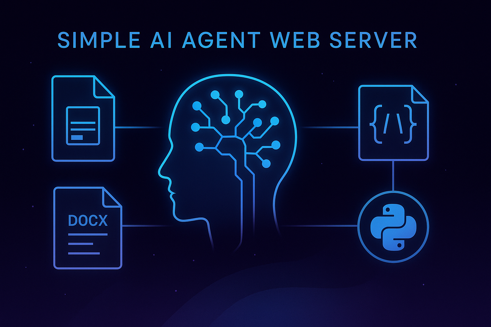

# 🤖 AI Agent Web Server

[](https://github.com/tabreu8/simple_ai_agent_web_server/actions/workflows/ci.yml)
[](https://codecov.io/gh/tabreu8/simple_ai_agent_web_server)
[](https://www.python.org/downloads/)
[](https://fastapi.tiangolo.com/)
[](https://github.com/psf/black)
[](https://opensource.org/licenses/MIT)



A smart document assistant that helps you upload documents and chat with an AI agent that has access to your knowledge base. Upload PDFs, Word documents, or text files, then ask questions and get answers based on your uploaded content!

This project serves as a sample code, to be used to better understand how to use these simple frameworks for AI Agent and RAG use-cases or to serve as a basis of development of more specific or complex use-cases.

## ✨ What Can It Do?

- 📄 **Upload Documents**: Support for PDF, Word (.docx), PowerPoint (.pptx), Excel (.xlsx), text files, and more
- 🤖 **Smart AI Agent**: Chat with an AI that can search through your uploaded documents
- 🔍 **Knowledge Search**: Find relevant information from your document collection
- 💬 **Conversation Memory**: The AI remembers context within conversation sessions
- 🌐 **Web Access**: AI can also search the web for additional information
- 🧠 **Enhanced LLM Parsing**: Optional AI-powered document processing for better understanding of complex layouts and images

## 🚀 Quick Start

### 1. Setup Your Environment

First, make sure you have Python >3.12 installed. Then:

```bash
# Clone or download this project
cd simple_ai_agent_web_server

# Create a virtual environment
python3 -m venv venv

# Activate it
source venv/bin/activate  # On Windows: venv\Scripts\activate

# Install dependencies
pip install -r requirements.txt
```

### 2. Configure Your OpenAI API Key

Create a `.env` file with your OpenAI API key:

```bash
# Copy the example file
cp .env.example .env
```

Edit the `.env` file and add your OpenAI API key:
```env
OPENAI_API_KEY=your_openai_api_key_here
```

> 💡 **Need an API key?** Get one from [OpenAI's website](https://platform.openai.com/api-keys)

### 3. Start the Server

```bash
uvicorn main:app --reload --host 0.0.0.0 --port 8000
```

The server will start at `http://localhost:8000` 🎉

## 📖 How to Use

### Using the Interactive API Documentation

The easiest way to try the application is through the built-in API documentation:

1. Open your browser to `http://localhost:8000/docs`
2. You'll see an interactive interface where you can test all features

### 📄 Upload Documents

**Option 1: Upload a file**
1. Go to `http://localhost:8000/docs`
2. Find the `POST /docs/insert` endpoint
3. Click "Try it out"
4. Use the file upload option to select your document
5. Click "Execute"

**Option 2: Add text directly**
1. Use the same endpoint but provide JSON data:
```json
{
  "documents": [
    {
      "content": "Your document text here",
      "metadata": {
        "filename": "my_notes.txt",
        "category": "personal"
      }
    }
  ]
}
```

### 🤖 Chat with the AI Agent

1. Go to the `POST /agent/query` endpoint
2. Try asking questions about your uploaded documents:

```json
{
  "query": "What information do you have about project management?",
  "session_id": "my_session_001"
}
```

**Example Questions:**
- "Summarize the main points from the uploaded documents"
- "What does the manual say about installation procedures?"
- "Find information about pricing in the uploaded files"

### 🔍 Search Your Documents

Use the `GET /docs/search` endpoint to search without the AI:

```
GET /docs/search?query=installation&n_results=5
```

## 💡 Usage Examples

### Complete Workflow Example

1. **Upload a document** (e.g., a user manual PDF)
2. **Ask the AI**: "How do I install this software according to the manual?"
3. **Follow up**: "What are the system requirements?"
4. **Search directly**: Find all mentions of "troubleshooting"

### Conversation Sessions

Use the same `session_id` to maintain conversation context:

```json
// First message
{
  "query": "What projects are mentioned in the documents?",
  "session_id": "work_session_123"
}

// Follow-up message (same session)
{
  "query": "What's the budget for the first project you mentioned?",
  "session_id": "work_session_123"
}
```

## 🛠️ Supported File Types

- **PDFs** (.pdf)
- **Microsoft Word** (.docx)
- **PowerPoint** (.pptx) 
- **Excel** (.xlsx)
- **Text files** (.txt)
- **Markdown** (.md)
- **HTML** (.html)
- **CSV** (.csv)
- **JSON** (.json)
- **XML** (.xml)

## 🌐 API Endpoints Overview

| Endpoint | Method | Purpose |
|----------|--------|---------|
| `/docs/insert` | POST | Upload documents or add text |
| `/docs/search` | GET | Search through documents |
| `/docs/{doc_id}` | GET | Get specific document |
| `/docs/{doc_id}` | PUT | Update document |
| `/docs/{doc_id}` | DELETE | Delete document |
| `/docs/stats` | GET | Get collection statistics |
| `/agent/query` | POST | Chat with AI agent |

## 🎯 Use Cases

- **Personal Knowledge Base**: Upload your notes, manuals, and documents, then ask questions
- **Customer Support**: Upload product documentation and let the AI help answer questions
- **Research Assistant**: Upload research papers and get summaries or find specific information
- **Document Analysis**: Upload reports and ask for insights or specific data points
- **Learning Aid**: Upload textbooks or course materials and ask study questions

## 🔧 Configuration Options

Edit your `.env` file to customize:

```env
# Required
OPENAI_API_KEY=your_api_key

# Optional - Storage locations
CHROMADB_PATH=knowledge_base     # Where documents are stored
AGENT_MEMORY_PATH=memory         # Where conversation history is stored
CHROMADB_COLLECTION=standard_collection  # Database collection name

# Optional - Enhanced Document Parsing
MARKITDOWN_USE_LLM=false         # Enable LLM-enhanced parsing for images/complex docs
MARKITDOWN_LLM_MODEL=gpt-4o      # LLM model for enhanced parsing
```

## ❓ Troubleshooting

**The AI doesn't find information from my documents:**
- Make sure your documents uploaded successfully (check the upload response)
- Try rephrasing your question
- The AI searches for semantically similar content, not exact keyword matches

**Upload fails:**
- Check that your file type is supported
- Ensure the file isn't corrupted
- Large files may take longer to process

**API key errors:**
- Verify your OpenAI API key is correct in the `.env` file
- Make sure you have credits available in your OpenAI account

**Server won't start:**
- Check that port 8000 isn't already in use
- Make sure all dependencies are installed: `pip install -r requirements.txt`

**LLM-enhanced parsing issues:**
- Ensure `OPENAI_API_KEY` is set when using `MARKITDOWN_USE_LLM=true`
- LLM parsing will fall back to standard mode if API key is missing
- Check your OpenAI account has sufficient credits for LLM processing
- Use `python demo_llm_parsing.py` to test both parsing modes

## 🤝 Need Help?

- Check the interactive API docs at `http://localhost:8000/docs`
- Look at the example requests in the API documentation
- See `README-DEV.md` for technical details and development information

---

*Enjoy building your smart document assistant! 🚀*

## Document Processing Features

- **Automatic Chunking**: Large documents are split into manageable chunks with overlap
- **Metadata Enrichment**: Automatic addition of source filename, file size, and processing timestamps
- **Content Extraction**: Text extraction from various file formats using MarkItDown
- **Enhanced LLM Parsing**: Optional AI-powered parsing for better image descriptions and complex document understanding
- **Error Handling**: Robust error handling for unsupported files and processing issues

### Enhanced LLM Parsing

For improved document processing, especially with images and complex layouts, you can enable LLM-enhanced parsing:

```env
MARKITDOWN_USE_LLM=true          # Enable AI-enhanced parsing
MARKITDOWN_LLM_MODEL=gpt-4o      # Choose your preferred model
```

**Benefits of LLM-enhanced parsing:**
- 📸 **Better Image Descriptions**: AI generates detailed descriptions of images, charts, and diagrams
- 📊 **Complex Layout Understanding**: Enhanced processing of tables, forms, and multi-column layouts  
- 🎯 **Semantic Content Extraction**: More intelligent text extraction and structure recognition
- 📋 **Metadata Enhancement**: Richer document metadata and content categorization

**Note:** LLM-enhanced parsing uses additional OpenAI API calls, which may increase costs but significantly improves document understanding quality.

## 📊 Development & CI/CD

This project includes comprehensive CI/CD setup with:

- **Automated Testing**: Unit tests, integration tests, and API tests
- **Code Quality**: Black formatting, flake8 linting, isort import sorting
- **Security Scanning**: Bandit security linting and safety dependency checks
- **Code Coverage**: Automated coverage reporting via Codecov
- **Multi-Python Support**: Tests run on Python 3.12 and 3.13

### Setting up Codecov (for coverage badge)

1. Go to [Codecov.io](https://codecov.io) and sign in with your GitHub account
2. Add your repository to Codecov
3. Add `CODECOV_TOKEN` to your GitHub repository secrets:
   - Go to your repo → Settings → Secrets and variables → Actions
   - Add new repository secret: `CODECOV_TOKEN` with the token from Codecov
4. The coverage badge will update automatically after your next CI run

### Available Badges

The badges in the README show:
- **CI Tests**: Current status of automated tests
- **Code Coverage**: Percentage of code covered by tests  
- **Python Version**: Supported Python versions
- **FastAPI Version**: Framework version used
- **Code Style**: Indicates use of Black code formatter
- **License**: MIT license information

